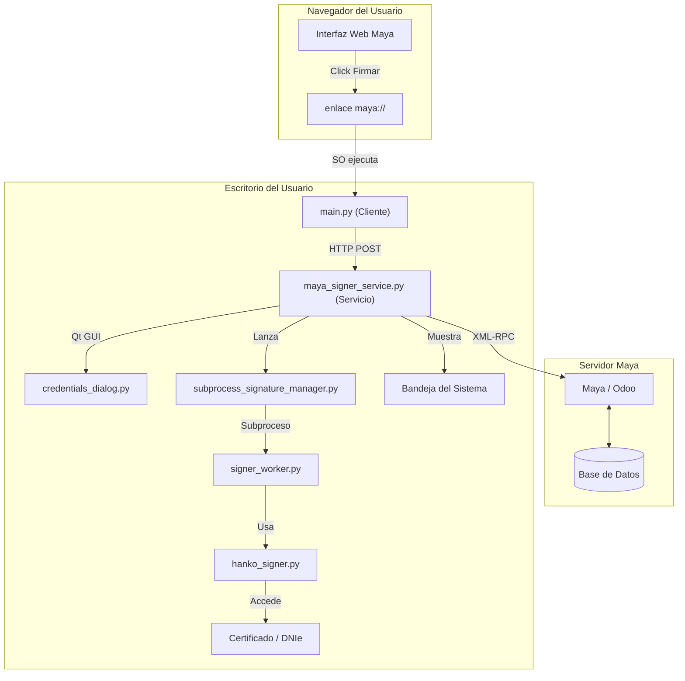
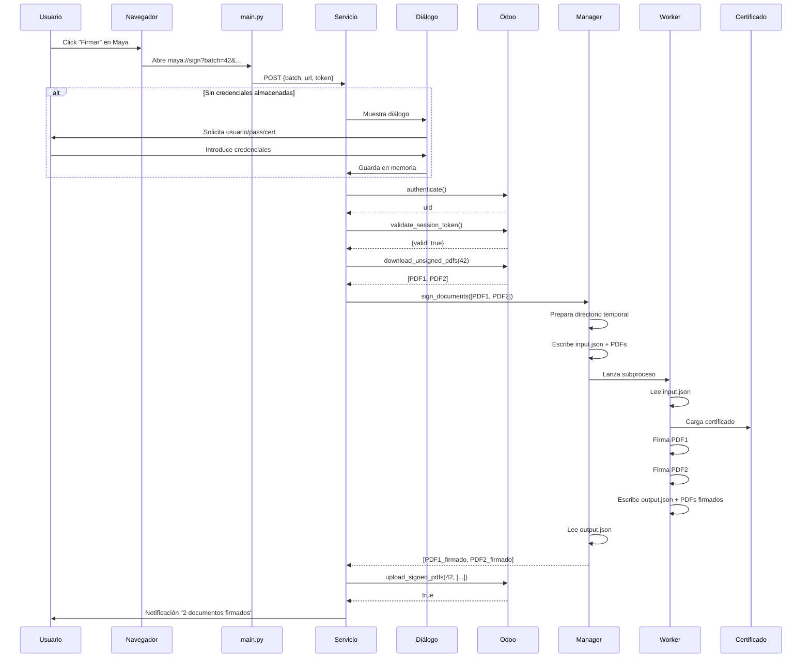

# Arquitectura

Diseño del sistema y cómo encajan los componentes.

## Diagrama general



## Comunicación entre componentes

### Cliente → Servicio (HTTP)

El cliente (`main.py`) y el servicio (`maya_signer_service.py`) se comunican vía HTTP local:

```
POST http://127.0.0.1:50304/
Content-Type: application/json

{
  "batch": 42,
  "url": "https://maya.example.com",
  "database": "production",
  "token": "tok_abc123"
}
```

### Servicio → Odoo (XML-RPC)

El servicio se comunica con Odoo mediante XML-RPC sobre HTTPS:

```
Servicio                          Odoo (XML-RPC)
   |                                   |
   |--- authenticate() ------------->  |
   |<-- uid -------------------------  |
   |                                   |
   |--- validate_session_token() --->  |
   |<-- {valid: true} ---------------  |
   |                                   |
   |--- download_unsigned_pdfs() --->  |
   |<-- [PDF1, PDF2, ...] -----------  |
   |                                   |
   |--- upload_signed_pdfs() --------> |
   |<-- true ------------------------  |
```

### Servicio → Worker (Archivos JSON)

El servicio y el worker no comparten memoria ni sockets. Se comunican exclusivamente por archivos en un directorio temporal:

```
Directorio temporal: /tmp/maya_signer_XXXXX/

Servicio escribe:                    Worker lee:
  input.json ─────────────────────>  input.json
  unsigned_1.pdf ─────────────────>  unsigned_1.pdf
  unsigned_2.pdf ─────────────────>  unsigned_2.pdf

Worker escribe:                      Servicio lee:
  status.json ────────────────────>  status.json  (polling cada 0.5s)
  signed_1.pdf ───────────────────>  signed_1.pdf
  signed_2.pdf ───────────────────>  signed_2.pdf
  output.json ────────────────────>  output.json
```

## Decisiones de diseño

### ¿Por qué el worker es un subproceso separado?

Las librerías de firma (pyHanko, PKCS#11) pueden ser inestables, especialmente con DNIe. Si el worker crashea:

- El servicio principal sigue corriendo
- El usuario puede reintentar
- No se pierde el estado de la aplicación

### ¿Por qué comunicación por archivos y no por sockets?

- Máxima aislamiento entre procesos
- Fácil de debuggear (puedes leer los archivos manualmente)
- No hay problemas de sincronización ni deadlocks
- El worker no necesita conocer nada del servicio

### ¿Por qué las credenciales solo en memoria?

- Se eliminan automáticamente cuando se cierra el servicio
- No hay riesgo de lectura desde disco
- El usuario puede limpiarlas manualmente en cualquier momento

### ¿Por qué un solo .spec para 3 plataformas?

- Un solo lugar donde añadir hidden imports
- Menos archivos que mantener
- El .spec detecta el SO automáticamente y se adapta

## Flujo completo de una firma


