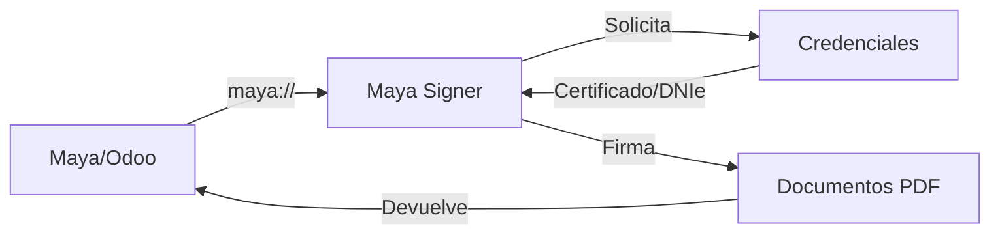

## Instalación Rápida

::: code-group

```bash [Linux]
# Descargar e instalar
sudo dpkg -i maya-signer_X.X.X_amd64.deb
sudo apt-get install -f

# Para DNIe
sudo apt-get install opensc pcscd
```

```powershell [Windows]
# Descargar maya-signer_X.X.X_x64.msi
# Doble clic → Siguiente → Instalar
```

```bash [macOS]
# Abrir maya-signer_X.X.X_macOS.dmg
# Arrastrar MayaSigner.app a Applications
# Abrir desde Applications
```

:::

## ¿Cómo Funciona?

<center>



</center>

1. **Usuario hace clic en "Firmar"** en _Maya_ (Odoo)
2. **Se abre el protocolo `maya://`** que lanza _Maya | Signer_
3. **Se solicitan credenciales** (solo primera vez)
4. **Se firman los documentos** con el certificado o DNIe
5. **Se devuelven firmados** a Maya automáticamente

## Características Principales

### Seguridad

- Credenciales almacenadas solo en memoria durante la sesión
- Validación de tokens de sesión con expiración
- Firma en proceso aislado sin acceso a red

### Facilidad de Uso

- Registro automático del protocolo `maya://`
- Interfaz gráfica sencilla e intuitiva
- Notificaciones en bandeja del sistema
- Sin configuración manual necesaria

### Flexibilidad

- Soporte para certificados .p12/.pfx
- Soporte para DNIe (Documento Nacional de Identidad electrónico)
- Múltiples servidores Maya simultáneos

## Próximos Pasos

<div class="vp-doc" style="margin-top: 2rem;">

**Para Usuarios:**
- [Instalación detallada](/user/installation)
- [Primer uso](/user/first-use)
- [Firmar documentos](/user/signing)

**Para Desarrolladores:**
- [Configurar entorno](/dev/setup)
- [Arquitectura](/dev/architecture)
- [Compilar instaladores](/dev/building/overview)

</div>

## Soporte

¿Necesitas ayuda? Tenemos varias opciones:

- 📖 [Documentación completa](/user/getting-started)
- 🐛 [Reportar un bug](https://github.com/Maya-AQSS/maya-signer/issues)