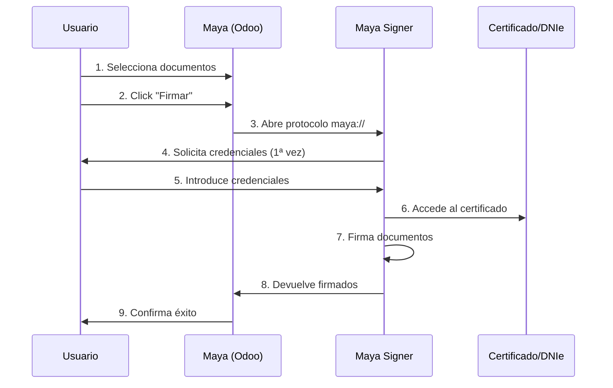

# Comenzar

Bienvenido a **Maya | Signer**, tu solución de firma electrónica para Maya (Odoo).

## ¿Qué es Maya | Signer?

**Maya | Signer** es una aplicación de escritorio que permite firmar documentos PDF electrónicamente desde el sistema Maya (basado en Odoo) usando certificados digitales o DNIe (Documento Nacional de Identidad electrónico).

## Requisitos del Sistema

### Mínimos

| Sistema | Versión Mínima | RAM | Espacio en Disco |
|---------|----------------|-----|------------------|
| Linux (Ubuntu/Debian) | 20.04 / 10+ | 512 MB | 200 MB |
| Windows | 10 | 1 GB | 300 MB |
| macOS | 10.13 (High Sierra) | 1 GB | 250 MB |

### Certificado Digital

Necesitas **uno** de los siguientes:

- **Certificado .p12 o .pfx** (emitido por autoridad certificadora)
- **DNIe** (con lector de tarjetas compatible)

::: tip Recomendación
Si usas DNIe en Linux, instala los drivers antes: `sudo apt-get install opensc pcscd`
:::

## Flujo de Trabajo

## Primeros Pasos

1. **[Instalar Maya Signer](/user/installation)** en tu sistema
2. **[Configurar credenciales](/user/configuration)** (solo primera vez)
3. **[Firmar tu primer documento](/user/signing)**

## Video Tutorial

::: info Próximamente
Estamos preparando video tutoriales para cada plataforma.
:::

## Características Principales

### Seguridad

- Las credenciales se guardan **solo en memoria** durante la sesión
- Comunicación cifrada con el servidor
- Tokens de sesión con expiración
- Proceso de firma aislado

### Rapidez

- Firma de múltiples documentos en segundos
- Servicio siempre listo en background
- Sin necesidad de abrir/cerrar la aplicación

### Facilidad

- Interfaz gráfica intuitiva
- Configuración mínima
- Notificaciones del estado
- Sin configuración manual de protocolos

## Soporte

Si tienes problemas:

1. Consulta el [Troubleshooting](/user/troubleshooting)
2. Revisa los [logs](/dev/reference/logs)
3. [Reporta un bug](https://github.com/Maya-AQSS/maya-signer/issues)
